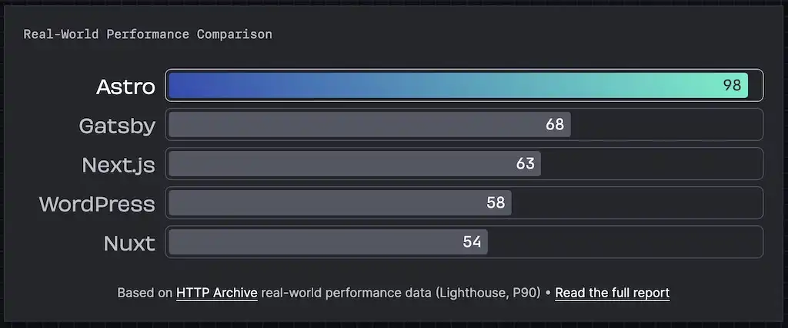

원문

- https://www.robinwieruch.de/react-trends/

## ASTRO (with react)

지난해 아스트로는 개츠비의 후계자로 나섰다.. 주로 정적 웹사이트로 알려졌지만 인기가 높아지면서 ASTRO는 웹 애플리케이션과 API 엔드포인트도 탐색하게 되었다. 따라서 성능이 뛰어난 웹사이트에 완벽하게 위치하는 동안 웹 개발자는 원래 아이디어 이상의 사용 사례를 고려하기 시작한다.

Astro로 구축된 웹사이트는 기본적으로 JavaScript없이 시작하고 비용이 많이 드는 모든 렌더링을 서버로 이동하기 때문에 성능이 뛰어나다. SSG(정적 사이트 생성)가 기본값이지만 SSR을 선택할 수도 있다.

Astro는 React와 엄격하게 연결되어 있지 않다. .astro파일에서 UI 구성요소를 생성하는 기본 방식을 사용하여 UI프레임워크 없이 Astro를 사용할 수 있다. 그러나 Astroㄴ를 사용하면 잘 디자인되고 기능적인 UI구성 요소의 환경을 만드는 데 필요한 모든 경험을 이미 갖고 있는 선호나는 구성요소 프레임워크를 선택할 수 있다.

Astro가 React와 같은 구성 요소 프레임워크와 함께 사용되면 여전히 Javascript가 없고 HTML과 CSS만 브라우저에 제공된다. 구성 요소가 대화형이 되는 경우에만 서버는 필요한 JavaScript를 클라이언트에 제공한다. 이 모든것은 Island Architecture라는 렌더링 패러다임에 의해 주도되는 Astro의 기본적으로 빠른 성능 스토리와 연결되어 있다.

개인적으로 2024년에는 프로젝트를 위해 Astro를 더 많이 탐구하고 싶다. 작년에 완벽한 성능/SEO 점수, 아름다운 테마 및 Astro Starlight가 제공하는 드롭인 문서가 포함된 새로운 스타트업을 위한 웹사이트를 부트스트랩하는데 이미 도움이 됬다. 모든 웹사이트가 이것을 기본값으로 제공하는 것은 시간 문제일 뿐이라고 생각한다. 새 프로젝트에서는 인증, API 엔드포인트 및 서버 렌더링 콘텐츠를 포함한 웹 애플리케이션 기능을 시험해 보고 싶습니다.

## Authentication (In React)

React에서의 인증(Auth)도 다시 흥미로워졌다. 왜냐하면 여러 스타트업과 오픈소스 프로젝트들이 이분에서 먼지를 털어내기 시작했기 때문이다. 오랫동안 Firebase Authentication, Auth0, Passport.js,NextAuth가 기본 선택지였지만, 이제는 저렴하면서도 UI중심의 인증 대안을 탐색할 수 있는 새로운 분야를 마침내 탐험할 수 있게 되었다.

[Supabase](https://supabase.com/)는 Google의 Firebase에 대한 오픈소스 대안이다. 인증 뿐만 아니라 PostgreSQL 데이터베이스, 실시간 구독, 스토리지, 서버리스 함수 등을 제공한다. Supabase 인스턴스는 자체 호스팅되거나 호스팅되는(아직 유료) 서비스로 사용될 수 있다. 많은 개발자들이 인증을 위해 이를 사용하면서 다른 서비스들을(예: 서버리스 DB로서의  [PlanetScale](https://planetscale.com/)) 다른 영역에서 선택한다.

[Clerk](https://clerk.com/)는 이 분야에서 다른 경쟁자로, 오로지 인증에만 초점을 맞춘다. React용 드롭인 컴포넌트를 통해 사용자를 쉡게 가입시키고 나중에 로그인할 수 있다. 그 이상으로, 한 개 또는 여러 조직 내에서 사용자와 그들의 역할을 관리할 수도 있다. 개인적으로는 새로운 스타트업을 위한 MVP를 부트스트래핑할 때 Clerk를 완벽한 해결책으로 발견했다.

마지막으로 Astro와 결합되어 인기를 얻었지만, 다른 프레임워크에서도 사용할 수 있는  [Lucia](https://github.com/lucia-auth/lucia)이다. 여기서 특히 오픈소스의 성격, 커뮤니티 노력, 그리고 애플리케이션과 데이터베이스 사이에 제공하는 명확한 추상화 계층에 대해 흥분된다. 후자는 사용자를 자신의 데이터 베이스에서 관리할 수 있게 해주는데, 이는 다른 인증 서비스와 대비할 때 큰 이점이다.

## TRPC For Full-Stack React Applications

지난해에는 안전한 타입 풀스택 애플리케이션을 위해 tRPC가 가장 마음에 들었다. 지난 솔로 프로젝트에서 (80K LoC), 데이터베이스, 서버 애플리케이션, 그리고 클라이언트 애플리케이션 간의 타입 안정성을 TypeScript타입으로 유지하기 위해 tRPC(그리고 Prisma를 데이터베이스 ORM으로)를 사용했다.

간단히 말해, Prisma는 데이터베이스 모델에서 타입을 생성하여 백엔드 애플리케이션을 위한 타입을 제공하는 반면, tRPC는 백엔드 부터 API레이어를 거쳐 프론트엔드까지 타입 안정성을 유지한다. 그렇다고 해서 API의 타입이 데이터베이스 모델에서 오는 타입과 같아야 하는 것은 아니다. 특히 풀스택 애플리케이션이 성장하면서 말이다.

이 모든 설정과 tRPC의 원격 절차 호출의 본질을 바탕으로, 클라이언트 애플리케이션은 평범한 함수를 호출함으로써 백엔드의 API를 호출할 수 있다. 내부적으로, tRPC는 JSON-RPC 사양을 사용하고 HTTP를 전송 계층으로 사용한다. 더 좋은 점은 tRPC가 캐싱과 요청의 배치 처리를 효율적으로 수행하기 위해 react-query와 결합될 수 있다는 것이다. 이외에도 쿼리 라이브러리를 사용함으로써 얻을 수 있는 여러 개선사항이 있다.

올해 tRPC가 어떻게 발전할지, 그리고 그들의 공식 React 서버 컴포넌트 통합이 시간이 지남에 따라 어떻게 모양을 갖춰갈지 기대된다.

## React Server Components And Next.js

React Server Components는 React에 의해 명세 (그리고 기본 구현 포함)로 발표되었고, 지난해 Next 13.4와 함께 커뮤니티에 의해 그 구현과 첫 채택이 이루어졌다. 모든 드라마와 도전을 제쳐두고, React Server Components는 웹 개발을 큰 패러다임 변화로 밀어붙이고 있다.

RSC는 React Hooks보다 더 큰 변화일 수 있다. 왜냐하면 우리가 더 큰 애플리케이션에서 React컴포넌트를 어떻게 사용할지에 대해 다시 생각하게 만들기 때문이다. Next.js와 그 새로운 App Router에서, RSC는 모든 React 개발자들에게 기본이 된다. React를 넘어서는 더 많은 프레임워크들이 서버 컴포넌트의 채택(및 구현)을 고려하는 동안, 이미 그것들을 구현한 새롭고 작은 프레임워크들(예: [Waku](https://github.com/dai-shi/waku))도 등장하고 있다.

이 새로운 아키텍처로 인해 많은 이점이 있으며, 여기서 모두 강조하기는 어렵지만, 예를 들어 보겠다. RSC를 사용하면 컴포넌트가 브라우저로 전송(또는 스트리밍)되기 전에 서버에서 컴포넌트 수준에서 데이터 패칭을 수행할 수 있다. 클라이언트에서 서버로의 네트워크를 통한 두려운 폭포형 요청이 과거의 일이 된다. 이제 폭포형 요청은 서버에서 훨씬 빠르게 발생하며, 성능 향상을 향해 나아갈 것이다.

RSC의 이러한 측면을 강조하는 것은 중요하다. 왜냐하면 이것이 React 생태계가 그것들에 어떻게 적응해야 하는지를 보여주기 때문이다. tRPC와 react-query는 클라이언트-서버 통신에 사용되므로, RSC가 서버에서 대부분의 데이터 패칭을 수행하는 API가 없는 세계에서 어떤 역할을 할지가 질문이 된다. 이미 존재하는 개념 증명들이 있으므로, 2024년에 이 모든 것이 어떻게 전개될지 기대해볼 수 있다.

## Tanstack Router For Spa React

싱글 페이지 어플리케이션(SPA)는 아직 죽지 않았다. 태너 린슬리가 모든 Raact 서버 컴포넌트의 홍소 복에서도 그렇게 자리매김하고 있다. 그렇다면 왜 이것이 중요할까? 그는 react-query와 react-table같은 가장 인기있는 React 라이브러리 뒤에 있는 주요 인물 중 하나이다. 그리고 최근에 새로운 라이브러리인 TanStack Router를 발표했다.

TanStack Router는 React생태계에서 중요한 공백을 채울 완벽한 시기에 나왔다. 많은 개발자들이 내장 라우터를 가진 메타 프레임워크인 Next.js와 Remix를 채택하는 동안, 아직까지 React에 대한 타입 안전 라우터를 처음부터 만든 사람은 없었다.

지난 몇 년 동안 TypeScript가 업계 표준이 된 이후로, React 생태계에 첫 클래스 TypeScript 지원을 제공하는 새로운 라우터가 등장하는 것에 대해 매우 흥분된다. 예를 들어, 개발자들이 타입 안전한 방식으로 URL상태를 읽고 쓸 수 있게 될 것이다. 아마도 이 새로운 라우터는 다른 기존 라우터들도 이 TS 우선 표준을 따르도록 밀어붙일 수도 있다.

## Vercel Pushing React on the Edge

vecel은 Next.js의 배후에 있는 회사로, 전체 React 서버 컴포넌트 운동에 크게 관여하고 있다. 여러 핵심 개발자들이 Vercel에 의해 고용되었기 때문에, 많은 개발자들은 Vercel이 React 주도적인 힘 이 되고 있다고 생각한다. 하지만 이러한 모든 음모론을 제쳐두고, 누군가 나서서 React의 경계를 넓히려고 하는것은 대단한 일이다.

Vercel은 React 서버 컴포넌트를 통해 React의 한계를 넘어서고 있을 뿐만 아니라, Next.js를 사용하여 React애플리케이션을 효율적으로 배포하고 사용자에게 전달하는 방식도 혁신하고 있다. Vercel에서 next애플리케이션을 운영하는 것은 Edge Runtime을 통해 React 컴포넌트를 스트리밍하는 옵션을 선택할 수 있는 이점을 제공한다.

애플리케이션을 에지에서 서비스하는 것의 성능 영향은 엄청나게 크다. 왜냐하면 더 이상 애플리케이션이 사용자에게 먼곳(예: 미국 동부)에 호스팅되지 않고, 애플리케이션의 사용자에게 가능한 가까운 곳에서 서버리스 함수로 운영되고 있기 때문이다. 전 세계에 읽기 복제본을 가진 서버리스 DB인 PlanetScale과 함께 사용될 때, 이것은 우리가 앞으로 애플리케이션을 어디에(또는 어떻게) 호스팅할지에 대한 흥미로운 추세가 된다.

## Bundlers For React: Turbopack vs Vite

Turbopack(Webpack의 창시자 및 Vercel에 의해 구축됨)은 Webpack의 후속 제품이다. 아직 제품 출시 준비가 완전히 되지 않았지만, Next.js 애플리케이션에서 로컬 개발을 위해 활성화될 수 있다. Turbopack은 가장 인기있는 자바스크립트 번들러(Webpack)에서 모든 교훈을 취하여 새로운 Rust기반 번들러에 적용했다. 예를들어, 트리 쉐이킹과 캐싱은 Webpack에서 사후 고려사항이었지만, Turbopack에서는 일등급 지원을 받는다.

과거에 번들러는 이미 많은 책임을 가지고 있었다. 하지만, 개발 및 생산 환경에서 클라이언트와 서버 컴포넌트를 교차하는 추세가 부상함에 따라, 애플리케이션의 다양한 진입점에서의 캐싱과 컴포넌트 수준에서의 데이터 패칭에 대해 알아야 할 필요성이 생겨났고, 번들러는 한 단계 업그레이드해야 했다. 따라서 Vercel에서 새로운 종류의 번들러에 대한 필요성이 생겼다.

개인적으로 나는 Next.js가 Vite와 그 서버 측 기능을 사용하는 것을 보고 싶었다. 하지만, 많은 다른 메타 프레임워크와 싱글 페이지 애플리케이션들이 지난해 동안 Vite를 그들의 번들러로 선택하는 동안 Vercel/Next는 현재로서는 이에 반대하기로 결정하고 Turbopack 작업을 시작했다.

## REACT COMPILER (KNOWN AS REACT FORGET)

리액트 개발자라면 useCallback, useMemo, memo에 대한 불만이 없는사람은 없을것이다. 리액트가 한동안 명시성을 고수하면서 다른 프레임워크들은 이러한 유틸리티 없이도 성능을 개선할 수 있었다. 그들은 기본적으로 빠르다.

하지만 리액트 팀은 상대적으로 조용하게 리액트 컴파일러라 불리는 컴파일러 작업에 착수했다. 이는 리액트 애플리케이션에서 모든 메모이제이션을 자동화할 것이다. 함수(useCallback), 값(useMemo), 컴포넌트(memo)의 수동 메모이제이션 과정이 곧 사라질 것이다. 리액트가 이 모든 것을 메모이제이션하여 다음 렌더링 때 모든 것을 다시 계산할 필요가 없도록 할 것이다.

최근에는 리액트 19와 새로운 컴파일러의 발표 가능성에 대한 소식과 소문이 돌고 있다. 이번 발표가 리액트 컴퍼런스 2024와 함께 이루어질 가능성이 매우 높다.

## BLOME

ESLint와 Prettier는 설정과 상호작용이 제대로 이루어지지 않으면 다루기 어려울 수 있지만, 모든 웹 개발자가 꼭 필요로 하는 도구이다. Biome(이전 이름: Rome)은 빠르고 올인원 툴체인 솔루션을 제공하여 이 분야에서 새로운 대안이 되고자 한다. 또 다른 유망한 올인원 툴체인 대안으로는 oxc가 있다.

Biome은 Rust로 더 성능 좋은 포매터를 만들어 Prettier로부터 $20,000의 현상금을 받았다. 이제 개발자들이 이를 받아들일지는 좀 더 두고 봐야 할 것이다. Next.js GitHub 토론 등 여러 곳에서 ESLint에 대한 엄격한 의존성을 줄이고 다른 린터를 사용할 수 있도록 하자는 논의가 진행 중이다.

개인적으로 이 프로젝트가 매우 기대된다. 이 프로젝트는 현대 웹 애플리케이션의 모든 필수 요소를 아주 빠르게 처리해줄 수 있는 하나의 툴체인이 될 수 있을 것 같다.

## HEADLESS UI LIBRARIES FOR REACT

React 개발자들은 매년 좋아하는 UI 라이브러리를 바꾸는 걸 참 좋아한다. 몇 년 전엔 Material UI가 대세였고, 그 다음엔 Semantic UI나 Ant Design, 그리고 Chakra UI, Mantine UI로 넘어가더니, 작년에는 shadcn/UI로 정착한 것 같았다. 이전 선택들은 주로 디자인과 사용성을 중시했는데, shadcn/UI에는 몇 가지 다른 점이 있었다.

shadcn/UI는 Tailwind를 CSS 변수와 함께 테마로 사용하는 첫 번째 인기 있는 UI 라이브러리였다. Tailwind를 따라 shadcn/UI는 노드 패키지로 설치되지 않고, 프로젝트에 복사해서 붙여넣어 자유롭게 컴포넌트를 수정할 수 있었다.

기능과 접근성 등 기본적인 스켈레톤만 제공하는 헤드리스 UI 라이브러리의 트렌드는 shadcn/UI가 시작한 건 아니었다. 인기 있는 UI 라이브러리에 의존하면서 고유한 디자인과 사용자 경험을 제공하는 게 항상 어려웠던 깊은 욕구에서 비롯된 것이다.

성능과 사용자 경험을 개선하기 위해 컴포넌트를 서버에서 렌더링하는 트렌드가 CSS-in-JS 솔루션, 예를 들어 Styled Components와 Emotion 같은 것들의 사용을 중단시켰다. 이들은 JavaScript를 실행하여 CSS를 출력함으로써 모든 성능 부담을 클라이언트/브라우저에 부과했기 때문이다. StyleX 같은 새로운 CSS-in-JS 솔루션은 유틸리티 우선 CSS로 컴파일해서 이 문제를 해결했다.

이런 트렌드에서 어떤 새로운 UI 라이브러리와 CSS 패러다임이 나올지 참 궁금하다. 헤드리스 UI 라이브러리, 예를 들어 Radix와 shadcn/UI, 그리고 유틸리티 우선 CSS, 예를 들어 Tailwind 같은 것들의 부상을 보았지만, 이미 대안들, 예를 들어 vanilla-extract, PandaCSS, CVA 같은 것들이 등장하고 있다.

2024년을 맞이하면서 웹 개발의 흥미로운 트렌드를 받아들이는 여러분의 열정에 공감한다. 성능에 대한 집중이 지배적인 가운데, 우리는 브라우저에서 놀라운 사용자 경험을 제공하는 미래로 나아가고 있는 것이 분명하다.
