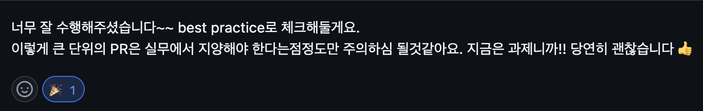

## 과제 개요

이번 과제에서는 **Vanilla JavaScript**로 SPA(Single Page Application)를 구현했다.

주요 요구사항은 **History API**로 라우터를 구현하는 것, **LocalStorage**를 사용한 사용자 관리 기능,

**컴포넌트 기반 구조 설계**, **초기 상태 관리 구현**, 그리고 **테스트 코드 통과**였다.

이전에 **react-router**를 사용해본 경험이 있지만,

그것이 내부적으로 어떻게 동작하는지는 구체적으로 알지 못했다.

이번 과제를 통해 **SPA 라우팅**이 어떻게 작동하는지 직접 구현하면서 더 깊이 이해할 수 있는 시간을 가졌다.
  

## 시도한 것들

1. **라우터 직접 구현**
   기존에 사용하던 라우터 라이브러리 대신, **브라우저의 History API**를 사용해 페이지 전환 기능을 구현했다.
   `history.pushState`와 `popstate` 이벤트를 관리하여 **클라이언트 사이드 라우팅**을 처리했고,
   URL이 바뀔 때마다 컴포넌트를 렌더링하고 브라우저 내비게이션 이벤트에 반응하도록 했다.

2. **경로 보호(Route Guard)**
   사용자 로그인 여부에 따라 특정 경로에 접근할 수 있도록 **경로 보호 로직**을 추가했다.
   로그인하지 않은 사용자가 보호된 경로로 접근하려 할 때는 로그인 페이지로 리다이렉트하고,
   로그인 상태일 경우에는 프로필 페이지에 접근할 수 있도록 했다.
   이를 통해 **사용자 상태에 따른 라우팅 처리**를 구현했다.

3. **상태 관리(Store) 구현**
   **싱글톤 패턴**을 사용해 전역 상태 관리 스토어를 구축했다.
   이를 통해 사용자 정보와 로그인 상태를 관리했고, 페이지 전환 시에도 상태가 유지되도록 처리했다.
   프레임워크 없이 직접 상태 관리 시스템을 구현하면서 **상태 변경에 따른 UI 업데이트**를 처리하는 방식을 배웠다.

4. **클린업 처리(Cleanup)**

   페이지 전환 시 기존 컴포넌트의 **리소스 정리**가 필요하다는 점을 깨닫고, **메모리 관리**와 **이벤트 리스너 제거**를 통해 불필요한 리소스가 남지 않도록 신경 썼다. 이를 통해 성능 최적화와 리소스 관리에 대한 중요성을 체감했다.

5. **이벤트 위임(Event Delegation)**

   전역 클릭 이벤트를 감지해 **이벤트 위임 방식**으로 링크 클릭을 처리했다. 클릭 이벤트를 통해 브라우저 새로고침 없이 경로를 변경하는 방식을 구현했고, **DOM 이벤트 처리 패턴**을 더 깊이 이해할 수 있었다.

## 배운 것들

이번 과제를 통해 **History API**를 사용해 페이지 새로고침 없이 URL을 변경하고, 브라우저의 뒤로 가기 및 앞으로 가기 기능을 관리하는 방법을 배웠다. 특히 `pushState`와 `popState` 이벤트를 활용해 페이지 전환을 처리하는 게 매우 흥미로웠다.

또한 **컴포넌트 기반 구조**로 코드를 설계하면서 **유지 보수성**과 **확장성**이 얼마나 중요한지 실감했다. React 같은 프레임워크 없이도 **상태 관리**를 직접 구현해보니, 프레임워크가 얼마나 많은 복잡한 작업을 대신 처리해주는지 깨닫게 되었다. 전역 상태 관리나 상태 변경에 따른 UI 업데이트를 모두 수동으로 처리해야 했기 때문이다. 이를 통해 **상태 관리 최적화**에 대한 고민을 할 수 있는 기회가 되었다.

**에러 바운더리**를 구현하면서 에러 처리 방식과 사용자 경험을 보호하는 방법도 배웠다. 특히 **센트리** 같은 도구를 통해 사용자의 피드백 없이도 에러를 자동으로 캐치하는 방식이 매우 매력적으로 다가왔다. 실무에서도 꼭 사용해보고 싶은 기능이었다.

## 앞으로의 다짐

이번 과제를 통해 나만의 루틴을 형성할 수 있었다.
매일 퇴근 후 꾸준히 시간을 내어 과제를 진행하면서 열정적으로 문제를 해결하는 내 모습을 보게 되었다. 앞으로 남은 9주 동안 얼마나 더 성장할 수 있을지 기대가 된다.

열심히 한 보람이 있었던 과제!! best practice를 받았다! 앞으로의 과제도 최선을 다해 해결할 수 있길!!
