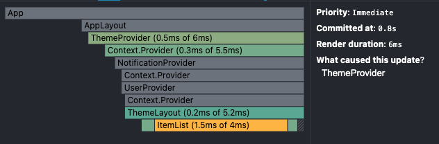
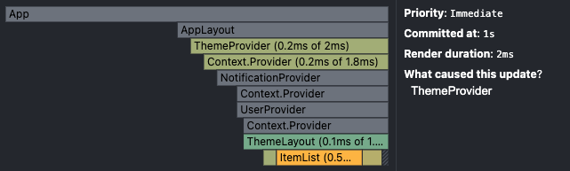

## 1. 문제

3주차에는 리액트 컴포넌트를 최적화하는 방법에 집중했다. 특히 메모이제이션과 렌더링 최적화를 통해 성능을 개선하는 것이 목표였다.

주요 문제는 크게 세 가지로 나뉘었다:

1. **컴포넌트 재렌더링**: 상태나 props가 바뀔 때마다 불필요하게 컴포넌트가 다시 렌더링되는 문제를 해결해야 했다. 이를 막기 위해서는 값이 실제로 변경된 경우에만 렌더링을 트리거해야 했고, 이를 최적화할 방법을 고민했다.
2. **메모이제이션**: 동일한 연산을 반복해서 수행하는 대신, 이전의 연산 결과를 기억해 성능을 높이는 방법을 적용할 필요가 있었다. 이 과정에서 `useMemo`와 `useCallback`을 적절히 활용하는 방법을 고민했다.
3. **깊은 비교 vs 얕은 비교**: 객체나 배열 같은 복잡한 데이터 구조를 다룰 때, 얕은 비교만으로는 변화 여부를 정확히 감지할 수 없었다. `deepEquals`를 활용해 깊은 비교를 적용할지, 아니면 성능 상의 이유로 얕은 비교를 사용할지에 대한 균형을 맞춰야 했다.

## 2. 시도

이번 주에는 컴포넌트 최적화를 위해 몇 가지 중요한 방법들을 시도해 보았다.

1. **`shallowEquals`와 `deepEquals` 구현**: 먼저 객체와 배열의 비교를 위해 얕은 비교와 깊은 비교 함수를 만들었다. `shallowEquals`는 주로 간단한 데이터 타입에서 사용하고, 내부 구조를 고려해야 하는 경우엔 `deepEquals`를 사용해 복잡한 데이터도 정확히 비교할 수 있도록 했다.
2. **`useMemo`와 `useCallback` 활용**: 상태나 props가 자주 변하지 않는 컴포넌트에서 불필요한 재계산을 피하기 위해 `useMemo`와 `useCallback`을 구현하고 적용했다. `useMemo`는 복잡한 연산이 들어간 부분에서 이전 결과를 기억하고, `useCallback`은 함수형 컴포넌트가 자주 재생성되지 않도록 해주었다.
3. **`memo`와 `deepMemo` 구현**: 컴포넌트를 최적화하기 위해 리액트의 `memo`와 비슷한 기능을 구현했다. `memo`는 얕은 비교를 통해 props가 바뀌지 않으면 컴포넌트가 다시 렌더링되지 않도록 했고, `deepMemo`는 더 깊은 비교가 필요한 상황에서 활용할 수 있게 만들었다.

## 3. 해결

### 1. `shallowEquals`와 `deepEquals`

```tsx
// 얕은 비교
function shallowEquals(
  objA: unknown,
  objB: unknown,
  equals = Object.is
): boolean {
  if (objA === objB) {
    return true
  }

  if (!isObject(objA) || !isObject(objB)) {
    return false
  }

  if (Array.isArray(objA) && Array.isArray(objB)) {
    return compareArrays(objA, objB, equals)
  }

  return compareObjects(objA, objB, equals)
}

// 깊은 비교
function deepEquals(objA, objB) {
  return shallowEquals(objA, objB, deepEquals)
}
```

이 함수들을 통해, 상황에 따라 얕은 비교와 깊은 비교를 적절히 선택해 사용할 수 있었다. 비교 성능을 극대화하면서도 정확도를 높일 수 있었다.

### 2. `useMemo`와 `useCallback`

```tsx
// useMemo
function useMemo<T>(factory: () => T, deps: DependencyList) {
  const ref = useRef({ deps: undefined, value: undefined })
  if (!shallowEquals(ref.current.deps, deps)) {
    ref.current.value = factory()
    ref.current.deps = deps
  }
  return ref.current.value
}

// useCallback
function useCallback<T extends (...args: any[]) => any>(
  factory: T,
  deps: DependencyList
) {
  return useMemo(() => factory, deps)
}

// useDeepMemo
function useDeepMemo<T>(factory: () => T, deps: DependencyList): T {
  return useMemo(factory, deps, deepEquals)
}
```

이 세 가지 훅(`useMemo`, `useCallback`, `useDeepMemo`)을 통해 성능을 최적화할 수 있었다. `useMemo`는 값의 재계산을, `useCallback`은 함수 생성을, `useDeepMemo`는 깊은 비교를 활용한 최적화를 가능하게 해주었다. 덕분에 불필요한 재렌더링을 방지하고, 복잡한 연산이 필요한 컴포넌트에서도 성능적으로 많은 이점을 얻을 수 있었다.

### 3. `memo`와 `deepMemo`

```tsx
export function memo(Component, equals = shallowEquals) {
  return newProps => {
    const previousPropsRef = useRef(null)
    if (!equals(previousPropsRef.current, newProps)) {
      previousPropsRef.current = newProps
    }
    return createElement(Component, newProps)
  }
}

export function deepMemo(Component) {
  return memo(Component, deepEquals)
}
```

이 두 함수로 컴포넌트를 더욱 세밀하게 최적화할 수 있었다. 특히, 복잡한 데이터 구조를 다루는 컴포넌트에 `deepMemo`를 적용함으로써 성능과 정확도 모두를 만족시킬 수 있었다.

## 4. 알게 된 것

이번 주차 작업을 통해 컴포넌트 최적화의 중요성을 다시 한 번 깨달았다. 특히, 메모이제이션을 적용했을 때 성능이 얼마나 개선되는지 체감할 수 있었다.

- **메모이제이션의 힘**: `useMemo`와 `useCallback`을 적재적소에 사용함으로써 불필요한 연산을 피하고, 좀 더 효율적으로 동작하도록 만들 수 있었다. 특히 복잡한 로직이 포함된 컴포넌트에서는 성능 차이가 확연했다.
- **깊은 비교와 얕은 비교의 균형**: 상황에 따라 `shallowEquals`와 `deepEquals`를 적절히 선택하는 것이 매우 중요하다는 점을 알게 되었다. 리액트에서는 이런 비교 방식을 통해 성능을 최적화하고 있다는 것을 알 수있었다. 모든 곳에 깊은 비교를 사용할 필요는 없지만, 필요한 곳에는 확실히 적용해야 한다는 것도 깨달았다.
- **컴포넌트의 불필요한 재렌더링 방지**: `memo`와 `deepMemo`를 통해 props가 변하지 않는 컴포넌트가 다시 렌더링되지 않도록 최적화할 수 있었다. 이를 통해 성능을 크게 개선할 수 있었고, 특히 대규모 데이터를 다룰 때 그 효과가 두드러졌다. 하지만 꼭 필요한 상태가 아니라면 사용하지 않는것이 좋다는 것도 알게되었다.

특히 이번주에는 컴포넌트의 성능을 최적화하는 과정에서 렌더링 성능에 대한 개선을 이루어냈다.

### 최적화 전



최적화 전에는 **ThemeProvider**에서 업데이트가 발생할 때, `ItemList`, `ThemeLayout` 같은 하위 컴포넌트들이 불필요하게 다시 렌더링되는 문제가 있었다. 전체 렌더링 시간이 **6ms**였고, 그중 `ItemList`가 **1.5ms**를 차지했다. `ThemeProvider`와 `Context.Provider`도 각각 **0.5ms**, **0.3ms**로 적지 않은 렌더링 시간이 걸렸다

### 최적화 후



최적화 후에는 useCallback과 **useMemo**를 적극적으로 활용하여, 렌더링 시간을 크게 줄일 수 있었다. 최적화 후 전체 렌더링 시간은 **2ms**로, 약 3배 가까이 성능이 개선되었다. `ItemList`의 렌더링 시간도 **1.5ms**에서 **0.5ms**로 줄었고, `ThemeProvider`의 렌더링 시간도 **0.5ms**에서 **0.2ms**로 감소했다.

### 성능 개선 요인

- **`memo`, `useMemo`, `useCallback` 적용**: 불필요한 재렌더링을 방지하기 위해 메모이제이션 훅들을 사용했다. 그 결과, `ThemeProvider`나 `Context.Provider`의 상태 변화가 있을 때에도 하위 컴포넌트가 불필요하게 렌더링되지 않도록 만들 수 있었다.
- **전체 렌더링 시간 단축**: 렌더링 시간이 **6ms**에서 **2ms**로 크게 줄어들었고, 특히 `ItemList` 같은 데이터가 많은 컴포넌트에서 효과가 컸다.

### 배운 점

이번 성능 최적화 과정을 통해, 컴포넌트 구조가 복잡해질수록 렌더링 성능에 큰 영향을 미칠 수 있다는 것을 실감했다. 최적화를 통해 불필요한 렌더링을 줄이고 성능을 개선하는 방법을 구체적으로 체험할 수 있었다. 앞으로도 성능을 고려한 컴포넌트 설계를 계속해서 신경 쓸 계획이다.

## **Keep : 현재 만족하고 계속 유지할 부분**

이번 주차 작업에서 가장 만족스러운 부분은 **최적화 작업**을 통해 성능을 확실히 개선한 것이다. 코드를 리팩토링하고 최적화하는 과정에서 성능의 변화가 체감되었고, 이를 통해 개발자로서의 성장을 느낄 수 있었다.

특히, 컴포넌트 단위에서 불필요한 렌더링을 줄이는 작업과 메모이제이션을 도입한 부분에서 **효율성**과 **유지보수성**을 동시에 높일 수 있었다는 점이 만족스러웠다.

앞으로 더 복잡한 애플리케이션에서도 이러한 최적화 기법들을 적용하고 싶고, 컴포넌트 성능을 고려하는 습관을 꾸준히 유지해보고싶다
